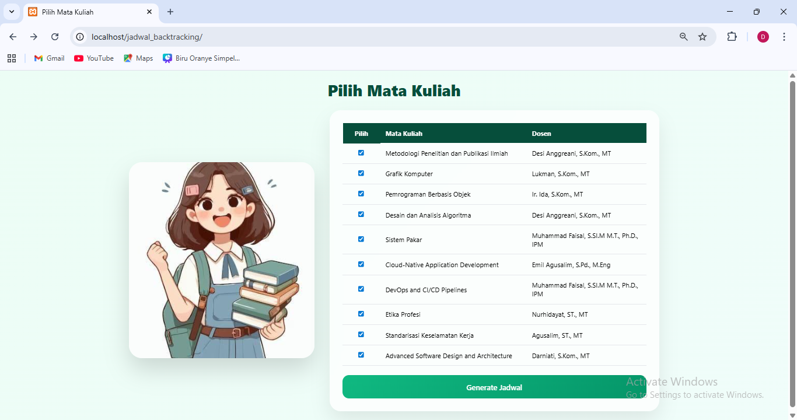
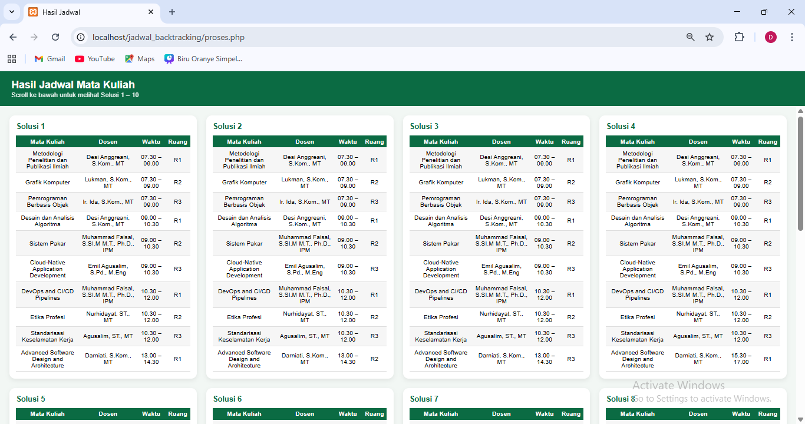

# Aplikasi Penyusunan Jadwal Mata Kuliah Menggunakan Algoritma Backtracking

## Mata Kuliah
**Desain dan Analisis Algoritma**

## Identitas
- **Dian Ramadhani** (105841116323) 
- **Futri Ayu Reski Amalia** (105841117623)

**Kelas: 5E**

## Deskripsi
Aplikasi berbasis web yang digunakan untuk menyusun jadwal mata kuliah
secara otomatis tanpa bentrokan dengan menerapkan algoritma backtracking.
Aplikasi ini dibuat sebagai tugas pada mata kuliah Desain dan Analisis Algoritma.

## Fitur
- Penyusunan jadwal mata kuliah secara otomatis
- Menghindari bentrokan waktu, dosen, dan ruangan
- Menghasilkan beberapa solusi jadwal yang valid

## Tampilan Aplikasi

### Halaman Utama

### Hasil Penyusunan Jadwal

.png)
.png)

## Algoritma yang Digunakan
- **Backtracking**

## Teknologi yang Digunakan
- PHP
- HTML
- CSS
- XAMPP (Web Server Lokal)

## Cara Menjalankan Aplikasi
1. Install XAMPP
2. Jalankan Apache
3. Pindahkan folder `jadwal-backtracking` ke direktori `htdocs`
4. Akses aplikasi melalui browser:
   http://localhost/jadwal_backtracking
